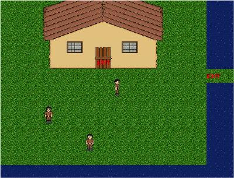



## Baronsoft \- Ore Online Game Engine

### Description

This code is great! Coded by Aaron. It will help you built your own online game!. Full multiuser platform. Chat functions. Attack features. Npc Attacks etc etc. Just everything you need and all this is OPEN SOURCE!!
 
### More Info
 

             |
---                |---
**Submitted On**   |2000-09-09 19:57:36
**By**             |[Clifford van Slimming](https://github.com/Planet-Source-Code/PSCIndex/blob/master/ByAuthor/clifford-van-slimming.md)
**Level**          |Intermediate
**User Rating**    |5.0 (25 globes from 5 users)
**Compatibility**  |VB 6\.0
**Category**       |[Games](https://github.com/Planet-Source-Code/PSCIndex/blob/master/ByCategory/games__1-38.md)
**World**          |[Visual Basic](https://github.com/Planet-Source-Code/PSCIndex/blob/master/ByWorld/visual-basic.md)
**Archive File**   |[CODE\_UPLOAD173503202001\.zip](https://github.com/Planet-Source-Code/clifford-van-slimming-baronsoft-ore-online-game-engine__1-21806/archive/master.zip)

